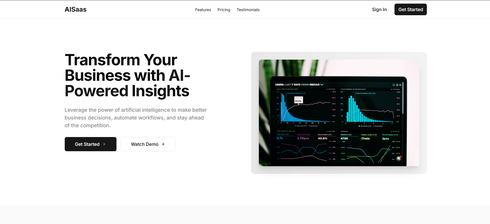
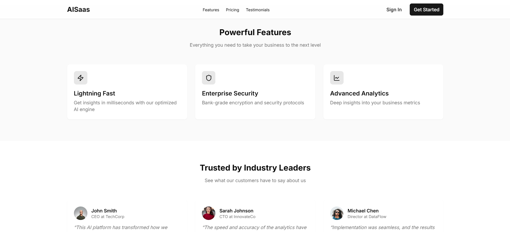
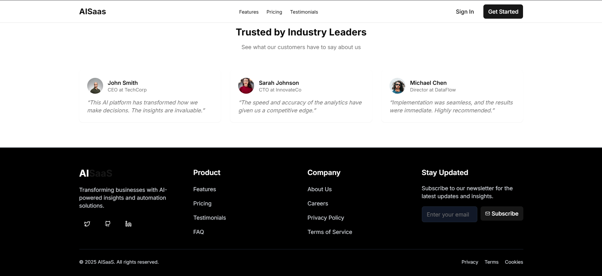

# Next.js Landing Page

This is a modern, responsive landing page built with:

-   **Next.js** (App Router)
-   **TypeScript**
-   **Tailwind CSS**
-   **shadcn/ui**

## Preview

  
  


## Installation

1. **Clone the repository**

    ```sh
    git clone https://github.com/rejzzzz/Next.js-landing-page.git
    cd Next.js-landing-page
    ```

2. **Install dependencies**

    ```sh
    pnpm install
    ```

3. **Run the development server**
    ```sh
    pnpm dev
    ```
